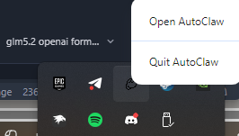
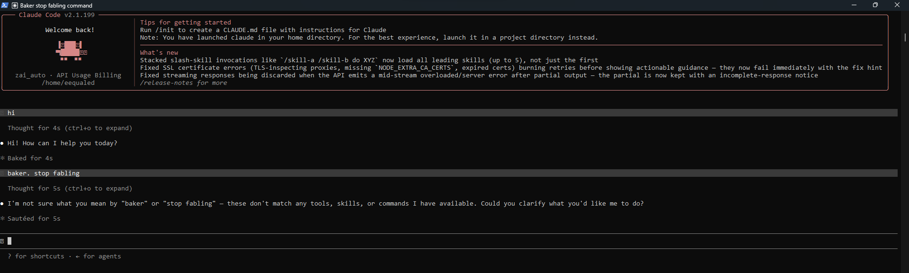

# AutoClaw Proxy

<p align="center">
  <b>A lightweight local proxy that exposes AutoClaw's AI models through<br>OpenAI-compatible and Anthropic-compatible APIs.</b>
</p>

<p align="center">
  =18">
  
  
</p>

---

Two files, pick what matches your tool:

| File | Format | Port | Use with |
|------|--------|------|----------|
| [`main.js`](./main.js) | OpenAI (`/v1/chat/completions`) | `18791` | OpenCode, Cursor, Continue, LiteLLM, Python/JS SDKs |
| [`anthropic.js`](./anthropic.js) | Anthropic (`/v1/messages`) | `18792` | Claude Code CLI, Anthropic SDK |

## Screenshots

### 1. Prerequisites — AutoClaw running as your background service

Make sure **AutoClaw is running and you're logged in**. The proxy reads auth from AutoClaw's local token file — as long as the AutoClaw desktop app is open, the proxy works.

<p align="center">
  <i>Screenshot: AutoClaw desktop app running and logged in (background service)</i>
  <br>
  
</p>

### 2. Proxy in action — it works

Start the proxy and watch it handle requests from your tool of choice:

<p align="center">
  <i>Screenshot: Terminal showing <code>node main.js</code> startup with "Token loaded — ready", then requests being proxied through</i>
  <br>
  
</p>

## How it works

```
Your App           AutoClaw Proxy          AutoClaw Backend
(OpenAI SDK)  ───▶  localhost:18791   ───▶  autoglm-api.autoglm.ai
```

AutoClaw handles authentication automatically. As long as AutoClaw is running and you're logged in, the proxy will work — no manual token setup needed.

## Prerequisites

- [AutoClaw](https://autoclaw.com) installed, running, and logged in (Windows / macOS only)
- Node.js 18+

## Quick Start

```bash
# OpenAI format (OpenCode, Cursor, etc.)
node main.js

# Anthropic format (Claude Code CLI)
node anthropic.js
```

When you see `[info] Token loaded` followed by `✅ Token loaded — ready`, you're good to go.

Optional env vars (work for both files):

```bash
PORT=3001 PROXY_KEY=mykey LOG_LEVEL=debug node main.js
```

| Variable    | Default  | Description                         |
|-------------|----------|-------------------------------------|
| `PORT`      | `18791`  | Port this proxy listens on          |
| `PROXY_KEY` | `mewmew` | API key clients must send           |
| `LOG_LEVEL` | `info`   | `debug` / `info` / `silent`         |

## API

### `GET /healthz`

Returns token status and upstream info.

```json
{
  "ok": true,
  "status": "live",
  "upstream": "https://autoglm-api.autoglm.ai/autoclaw-proxy/proxy/autoclaw",
  "port": 18791
}
```

### `GET /v1/models`

Lists available models in OpenAI format.

### `POST /v1/chat/completions`

OpenAI-compatible chat completions. Supports both streaming (`stream: true`) and non-streaming.

**Headers:**
```
Authorization: Bearer mewmew
Content-Type: application/json
```

## Models

| ID | Name | Context | Max Output | Notes |
|----|------|---------|------------|-------|
| `zai_auto` | Auto | 1M | 384K | Routes to optimal model (DeepSeek-V4, GLM-5.1, GLM-Air, …) |
| `zai_glm-5-turbo` | GLM-5-Turbo | 200K | 128K | Zhipu AI GLM-5 Turbo |
| `openrouter_glm-5.2` | GLM-5.2 | 1M | 300K | Latest GLM-5.2 via OpenRouter |

All models include `reasoning_content` in responses when the upstream model reasons.

## Integrations

### OpenCode

```json
{
  "providers": {
    "autoclaw": {
      "type": "openai-compatible",
      "baseURL": "http://localhost:18791/v1",
      "apiKey": "mewmew"
    }
  }
}
```

Or add it as a custom model directly in the UI:
- **API Format**: OpenAI Chat Completions
- **URL**: `http://localhost:18791/v1`
- **Model ID**: `zai_auto` (or any model from the table above)
- **API Key**: `mewmew`

### Claude Code CLI

Add to `~/.claude/settings.json`:

```json
{
  "env": {
    "ANTHROPIC_BASE_URL": "http://localhost:18792",
    "ANTHROPIC_AUTH_TOKEN": "mewmew"
  }
}
```

Claude model names are automatically mapped to the best available AutoClaw model:

| Claude model | Routes to |
|---|---|
| `claude-opus-*` | `openrouter_glm-5.2` |
| `claude-sonnet-*` | `zai_auto` |
| `claude-haiku-*` | `zai_glm-5-turbo` |

### Python

```python
from openai import OpenAI

client = OpenAI(base_url="http://localhost:18791/v1", api_key="mewmew")

# Streaming
with client.chat.completions.stream(
    model="zai_auto",
    messages=[{"role": "user", "content": "Hello!"}],
) as stream:
    for text in stream.text_stream:
        print(text, end="", flush=True)

# Non-streaming
response = client.chat.completions.create(
    model="zai_auto",
    messages=[{"role": "user", "content": "What is 2+2?"}],
    stream=False,
)
print(response.choices[0].message.content)
```

### JavaScript

```javascript
import OpenAI from "openai";

const client = new OpenAI({
  baseURL: "http://localhost:18791/v1",
  apiKey:  "mewmew",
});

const stream = await client.chat.completions.create({
  model:    "zai_auto",
  messages: [{ role: "user", content: "Hello!" }],
  stream:   true,
});

for await (const chunk of stream) {
  process.stdout.write(chunk.choices[0]?.delta?.content ?? "");
}
```

### Cursor / Continue / Other Tools

Any tool that supports OpenAI-compatible providers works. Point it at `http://localhost:18791/v1` with API key `mewmew` and you're set.

## Notes

- Only one AutoClaw account can be active at a time — multi-account pooling isn't supported
- The proxy key (`PROXY_KEY`) is just a local password for this proxy, not your AutoClaw credentials — set it to whatever you want
- If a request fails with 401, the proxy automatically refreshes its auth and you can retry immediately
- No dependencies beyond Node.js built-in modules — zero `node_modules`, zero install step

## Special Thanks

<p align="center">
  
</p>

## License

MIT License + Jarona Rights™ (sorry to keep u waiting)
