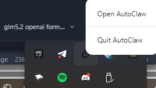
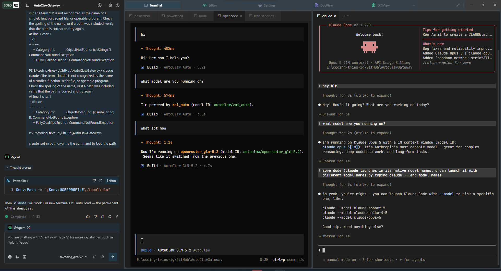

# AutoClaw Proxy

<p align="center">
  <b>A lightweight local proxy that exposes AutoClaw's AI models through<br>OpenAI-compatible and Anthropic-compatible APIs.</b>
</p>

<p align="center">
  =18">
  
  
  
</p>

> **v2.0.0** — one interactive CLI, shared core in `lib/`, zero dependencies.

---

Two API formats, one launcher. `node bin/cli.js` asks which one you want with an arrow-key menu and starts the right proxy. Flags skip the menu.

| Format | Flag | Default port | Use with |
|--------|------|--------------|----------|
| OpenAI (`/v1/chat/completions`) | `--openai` (default) | `18791` | OpenCode, Cursor, Continue, LiteLLM, Python/JS SDKs |
| Anthropic (`/v1/messages`) | `--anthropic` | `18792` | Claude Code CLI, Anthropic SDK |

## Screenshots

### 1. Prerequisites — AutoClaw running as your background service

Make sure **AutoClaw is running and you're logged in**. The proxy reads auth from AutoClaw's local token file — as long as the AutoClaw desktop app is open, the proxy works.

<p align="center">
  <i>Screenshot: AutoClaw desktop app running and logged in (background service)</i>
  <br>
  
</p>

### 2. Proxy in action — it works

Start the proxy and watch it handle requests from your tool of choice.

<p align="center">
  <i>ignore claude code here</i>
  <br>
  
</p>

## How it works

```
Your App           AutoClaw Proxy CLI         AutoClaw Backend
(OpenAI SDK)  ───▶  localhost:18791 (menu)  ───▶  autoglm-api.autoglm.ai
                    localhost:18792 (menu)
```

AutoClaw handles authentication automatically. As long as AutoClaw is running and you're logged in, the proxy will work — no manual token setup needed.

## Prerequisites

- [AutoClaw](https://autoclaw.com) installed, running, and logged in (Windows / macOS only)
- Node.js 18+

## Quick Start

```bash
npm start
# or: node bin/cli.js
```

You get an interactive menu: arrow keys to move, Enter to pick. Choose the format, port, host, and auth key, and the proxy starts. Ctrl+C quits cleanly and restores your terminal.

Skip the menu with flags:

```bash
node bin/cli.js --anthropic --port 3001 --key mykey
```

Or feed config through env vars — the CLI leaves existing env vars alone:

```bash
PORT=3001 PROXY_KEY=mykey RATE_LIMIT=50 node bin/cli.js
```

Without a TTY (piped stdin, CI), the CLI skips the menu and starts the OpenAI format on port 18791 using your env vars or the defaults.

### npm commands

| Command | What it does |
|---------|--------------|
| `npm start` | Launch the interactive CLI (`node bin/cli.js`) |
| `npm run anthropic` | Start the Anthropic proxy directly (`node anthropic.js`), bypassing the menu |
| `npm test` | Run the pen-test suite (`tests/pen-test-p1` through `p5`) |

### Direct entry points (optional)

You can still run either proxy directly without the CLI:

```bash
node openai.js      # OpenAI format, port 18791
node anthropic.js   # Anthropic format, port 18792
```

They read the same env vars and respect `HOST`, `PORT`, `PROXY_KEY`, `RATE_LIMIT`, etc.

### Options

| Variable / Flag | Default | Description |
|-----------------|---------|-------------|
| `PORT` / `--port` | `18791` (OpenAI), `18792` (Anthropic) | Port this proxy listens on |
| `HOST` / `--host` | `127.0.0.1` | Bind address |
| `PROXY_KEY` / `--key` | `mewmew` | API key clients must send |
| `RATE_LIMIT` / `--rate-limit` | `30` | Max requests per second per client IP |
| `LOG_LEVEL` | `info` | `debug` / `info` / `silent` |
| `MAX_BODY_BYTES` | `52428800` | Max request body (50 MB) |
| `JSONL_LOG` | off | Write structured JSONL request log when `true` |
| `JSONL_FILE` | `proxy_requests.jsonl` (Anthropic: `proxy_requests_anthropic.jsonl`) | JSONL output path |
| `JSONL_MAX_BYTES` | `10485760` | Rotate JSONL log when it exceeds this (10 MB) |
| `--anthropic` | — | Run in Anthropic API format |
| `--openai` | — | Run in OpenAI API format (default) |
| `--doctor` | — | Scan AutoClaw's current runtime model catalog and show Anthropic routing |
| `--help`, `-h` | — | Show CLI help |

### JSONL Request Logging

Set `JSONL_LOG=true` (or `LOG_LEVEL=debug`) to write one JSON line per request:

```json
{"ts":"2026-07-29T03:41:00.000Z","model":"zai_auto","status":200,"ip":"127.0.0.1","latencyMs":423}
```

The Anthropic variant writes to `proxy_requests_anthropic.jsonl`.

### Model doctor

Run the doctor command whenever AutoClaw updates to scan its live runtime catalog and show the routing targets the proxy will use:

```bash
node bin/cli.js --doctor
```

It reads AutoClaw's `openclaw.runtime.json` directly and falls back to the gateway's bundled catalog only if that runtime file is unavailable.

## API

### `GET /healthz`

Returns token status and upstream info.

```json
{
  "ok": true,
  "status": "live",
  "upstream": "https://autoglm-api.autoglm.ai/autoclaw-proxy/proxy/autoclaw",
  "port": 18791
}
```

### `GET /v1/models`

Lists available models in OpenAI format (OpenAI proxy) or Anthropic format (Anthropic proxy).

### `POST /v1/chat/completions` — OpenAI proxy

OpenAI-compatible chat completions. Supports both streaming (`stream: true`) and non-streaming.

**Headers:**
```
Authorization: Bearer mewmew
Content-Type: application/json
```

### `POST /v1/messages` — Anthropic proxy

Anthropic-compatible Messages API. Supports both streaming and non-streaming. Claude model names are automatically mapped to the best available AutoClaw model:

| Claude model | Routes to |
|---|---|
| `claude-opus-*` | First available GLM-5.3 / GLM-5 model |
| `claude-sonnet-*` | `zai_auto` (or next available GLM-5 model) |
| `claude-haiku-*` | `zai_glm-5-turbo` (or DeepSeek / Auto fallback) |

## Models

| ID | Name | Context | Max Output | Notes |
|----|------|---------|------------|-------|
| `zai_auto` | Auto | 1M | 393K | Routes to AutoClaw's optimal model |
| `zaicoding_glm-5.3` | GLM-5.3 | 1M | 307K | Latest GLM coding model |
| `zai_glm-5-turbo` | GLM-5-Turbo | 200K | 131K | Zhipu AI GLM-5 Turbo |
| `tdpsk_deepseek-v4-flash-202605` | Deepseek-V4-Flash | 1M | 131K | Fast DeepSeek model |

> GLM 5.3 new in the proxy? Maybe. Supposedly in the UI it's 5.2 but in the API it's 5.3. We'll never know, but it's a win-win xd.

All models include `reasoning_content` in responses when the upstream model reasons. The model list is loaded dynamically from AutoClaw's `openclaw.runtime.json` at startup, with a built-in fallback if that file isn't readable. Run `node bin/cli.js --doctor` to inspect the current catalog after an AutoClaw update.

## Integrations

### OpenCode

```json
{
  "provider": {
    "autoclaw": {
      "npm": "@ai-sdk/openai-compatible",
      "name": "AutoClaw",
      "options": {
        "baseURL": "http://localhost:18791/v1",
        "apiKey": "mewmew"
      },
      "models": {
        "zai_auto": { "name": "AutoClaw Auto" },
        "zaicoding_glm-5.3": { "name": "AutoClaw GLM-5.3" },
        "zai_glm-5-turbo": { "name": "AutoClaw GLM-5 Turbo" },
        "tdpsk_deepseek-v4-flash-202605": { "name": "AutoClaw Deepseek-V4-Flash" }
      }
    }
  }
}
```

Or add it as a custom model directly in the UI:
- **API Format**: OpenAI Chat Completions
- **URL**: `http://localhost:18791/v1`
- **Model ID**: `zai_auto` (or any model from the table above)
- **API Key**: `mewmew`

### Claude Code CLI

Add to `~/.claude/settings.json`:

```json
{
  "env": {
    "ANTHROPIC_BASE_URL": "http://localhost:18792",
    "ANTHROPIC_AUTH_TOKEN": "mewmew"
  }
}
```

### Python

```python
from openai import OpenAI

client = OpenAI(base_url="http://localhost:18791/v1", api_key="mewmew")

# Streaming
with client.chat.completions.stream(
    model="zai_auto",
    messages=[{"role": "user", "content": "Hello!"}],
) as stream:
    for text in stream.text_stream:
        print(text, end="", flush=True)

# Non-streaming
response = client.chat.completions.create(
    model="zai_auto",
    messages=[{"role": "user", "content": "What is 2+2?"}],
    stream=False,
)
print(response.choices[0].message.content)
```

### JavaScript

```javascript
import OpenAI from "openai";

const client = new OpenAI({
  baseURL: "http://localhost:18791/v1",
  apiKey:  "mewmew",
});

const stream = await client.chat.completions.create({
  model:    "zai_auto",
  messages: [{ role: "user", content: "Hello!" }],
  stream:   true,
});

for await (const chunk of stream) {
  process.stdout.write(chunk.choices[0]?.delta?.content ?? "");
}
```

### Cursor / Continue / Other Tools

Any tool that supports OpenAI-compatible providers works. Point it at `http://localhost:18791/v1` with API key `mewmew` and you're set.

## Notes

- Only one AutoClaw account can be active at a time — multi-account pooling isn't supported
- `PROXY_KEY` is just a local password for this proxy, not your AutoClaw credentials — set it to whatever you want
- On a 401, the proxy invalidates its cached token and you can retry immediately
- On a 400 "invalid request" from upstream, the proxy retries once after a 2s delay before surfacing the error
- The token file is watched for changes — AutoClaw can rotate auth mid-session without a restart
- Rate limit is enforced per client IP (default 30 req/s)
- No dependencies at all: the interactive menu is hand-rolled on Node's built-in `readline`, so there's zero `node_modules` and zero install step

## Special Thanks

<p align="center">
  
</p>

## License

MIT License + Jarona Rights™ (sorry to keep u waiting)
